## 首页 

# 移动 OA 及社区 · 从 0 到 1
> 聊聊那些「画风清奇」的解决方案

## 前言 

在 17 年中，绝大部分的工作重心，我都是放在，移动 OA 及社区上。

所以我希望做一下总结跟分享，把工作上遇到的问题、用到的解决方案、还有积累的经验、沉淀下来。

<!-- Note -->
<!-- 我的分享会做得比较细，而且涉及的内容方方面面都有一点。 -->

## 目录 

目录

### 目录结构与开发模式 

当我们开始一个新的项目时，我们会有一个初始的目录结构。

而这个目录结构就是这个项目的雏形，也将会奠定这个项目的开发模式以及维护的难度。

<!-- Note -->
<!-- 我想聊一下不同的目录结构与后续维护的关系。 -->

#### 传统目录 

在传统项目目录结构下，网站下会并存若干页面。

每个页面都有公共代码，例如头部、登录状态、导航、侧栏、等等。

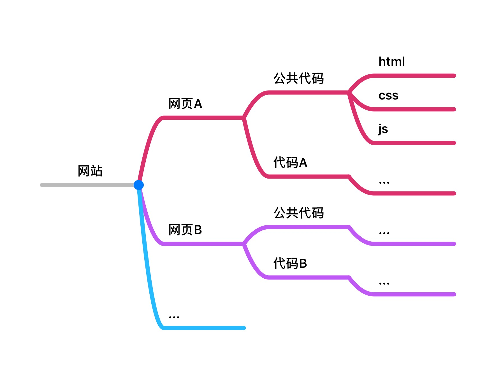

当我们需要新增一个，页面的时候，往往会经历以下步骤：

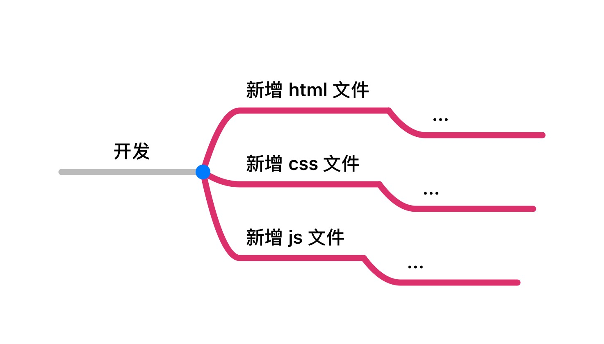

举个例子，客服网站移动端：

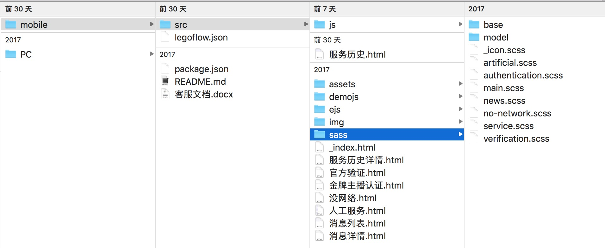

#### 模块化思想 

基于 `Don't Repeat Yourself` 原则，我们有了更好的迭代方案：

<!-- Note -->
<!-- 我们可以将公共的逻辑写成一个模块并且按需引入 -->

```ejs
<!-- ejs -->
<% include header %>

<link href="xx.css">
<!-- your code -->
<script src="xx.js"></script>

<% include footer %>
```

```sass
// sass
@import 'base.scss';
// your code
```

```js
// js
import 'public.js';
// your code
```

#### 前端路由 

<!-- Note -->
<!-- 或者我们可以尝试使用前端路由 -->

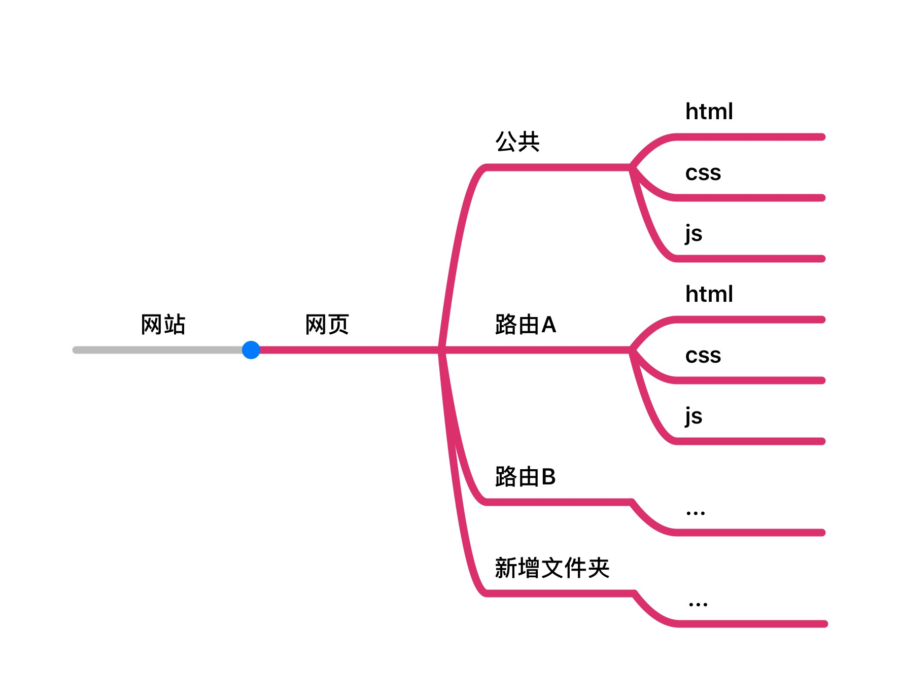

在虚拟路由的模式下，

我们的入口页面变成了唯一的一个。

而每个具体的页面，对应一个抽象的路由。

<!-- Note -->
<!-- 简单地看，我们的代码，其实没有做到节省。 -->
<!-- 需要写的 `css` `js` 仍然需要。 -->

文件放在一起了，更加集中、更加一目了然、更便于维护。

除此而外，当我们引入了虚拟路由后，

在路由这个层面上，就可以做更多的处理。

比如，可以快速新增一个路由别名，而不是手动复制代码，等等。

<!-- Note -->
<!-- 虽然，目前为止，举例都是基于 `Vuejs`。 -->
<!-- 但实际上虚拟路由，并没有局限于 `Vuejs`。 -->
<!-- 我们完全可以使用 `Reactjs` 去实现或者其他框架。 -->

#### 内嵌页使用前端路由的优势 

除了移动 OA、社区、包括一件以及 `Mango` 都使用了前端路由。

当我们开发网页的时候，无论是移动端还是 PC 端，地址栏往往是我们必须关注的事情。

更短、更简单、更直观、的地址，往往有更好的引导作用。

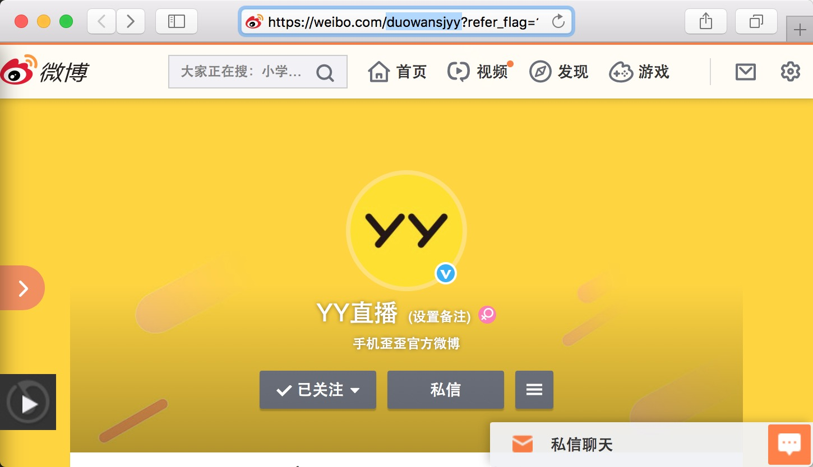

<!-- Note -->
<!-- 当我们使用前端路由去开发网页的时候就不得不考虑动态路由的应用情景 -->

而开发内嵌页页面的时候，页面的地址栏，对于用户是不可见的。

```js
location.href = 'https://space.bilibili.com/11731027/#/';
```

```js
sdk.push('https://space.bilibili.com/user', { id : 11731027 });
```

所以开发内嵌页页面的时候，我们可以排除`动态路由`以及`嵌套路由`的场景，关注每个页面单独的逻辑。

<!-- Note -->
<!-- 另外，路由的异步加载，是推荐使用的功能 -->

### 环境分离与控制 

使用 `IDE`，包括写 `iOS` 应用的 `XCode` 以及写游戏的 `Cocos Creator`。

都提供判断环境相关的 `Api`。

但是基于 `JavaScript` 的 `Web` 应用则没有这个概念。

即使我们使用了 `LegoFlow` 的前提下，环境分离仅限于开发模式。

<!-- Note -->
<!-- 并不能满足作为应用级别的内嵌页的开发需求 -->

#### 数据与逻辑分离 

数据与代码，应该有各自的独立的环境分离的系统。

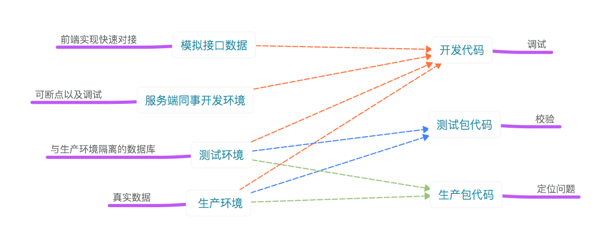

<!-- Note -->
<!-- 针对数据的环境分离，我推荐家良的 APIER -->

https://github.com/yyued/APIER.js/blob/master/README.zh-CN.md

* 切换接口环境与模拟数据
* 自定义请求方式，可扩展 `SDK` 方法
* 前后拦截器，数据格式化
* 调试模式

<!-- Note -->
<!-- 所谓调试模式就是将请求的过程暴露到全局上 -->
<!-- 我们可以去查询请求记录 -->
<!-- 而且不局限于 WIFI，移动蜂窝网络也可以 -->

---

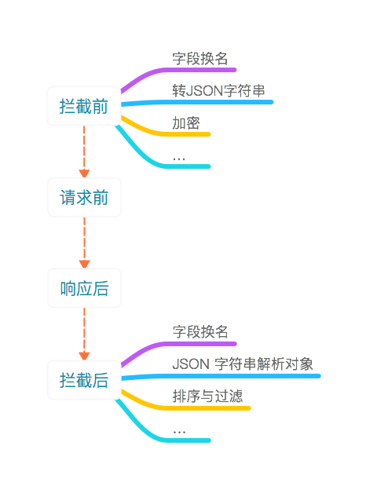

---

页面发起请求的参数与返回值

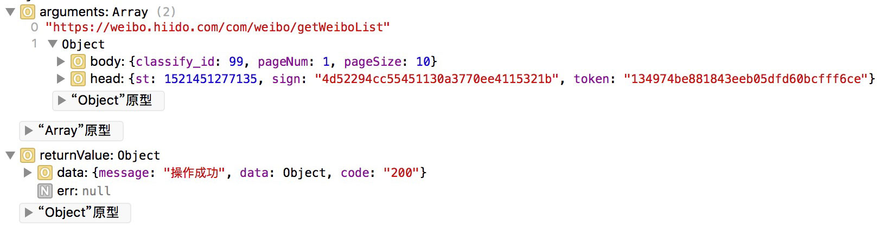

---

服务器处理的实际请求与实际响应

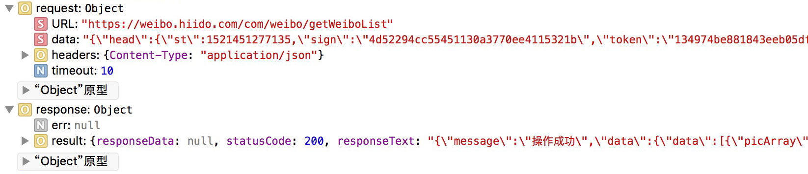

---

请求用时


---

#### 代理对象、「宇宙」、「黑洞」 

`Getter`、`Setter` 大家应该不陌生了。

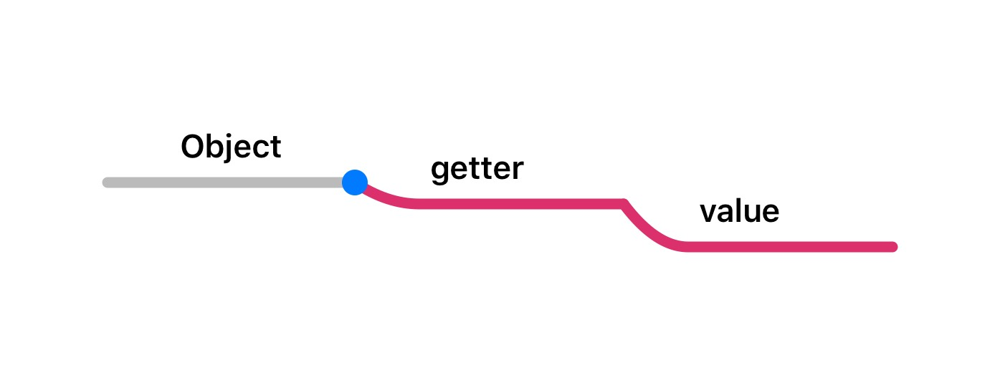

`Proxy` 对象不局限于指定的 `Key`。


<p class="tip">
脑洞一：为什么，我们就不能返回 `Proxy` 它自己呢？
</p>

代理对象，第一特性：「宇宙」。


<!-- Note -->
<!-- 代理对象可以无限循环引用，是一个可以一直访问的对象。它像宇宙一样无限大。没有边际。 -->

<p class="tip">
脑洞二：`Function` 也是 `Object`。为什么不用 `Function` 去实例化一个 `Proxy` 呢？
</p>

代理对象，第二特性：「黑洞」。

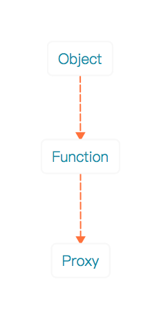

<!-- Note -->
<!-- 我们都知道黑洞就是连光也无法逃逸的天体。 -->
<!-- 而 Proxy 就是一个永远无法抛出错误的对象 -->

https://fiddle.jshell.net/lixinliang/zkjvLqnb/show/

#### 终端分离 

<!-- Note -->
<!-- 代理对象说了挺多的，但是本质，还是在解决环境分离的事情 -->

数据接口跟逻辑代码的组合我就省略了。

最终执行代码的载体，主要有以下类别。

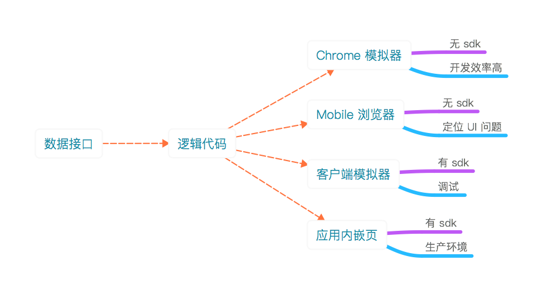

<!-- Note -->
<!-- 虽然我们在开发内嵌页，但是我们还是回回归到网页的本质去做开发 -->
<!-- 无论是开发还是定位问题，但有极高的效率 -->

当我们在没有 `SDK` 的浏览器上执行内嵌页代码，往往会有以下错误。

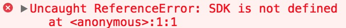

而代理对象就能解决这个问题。

### 项目架构与解耦 

项目架构与解耦

<!-- Note -->
<!-- 说起项目架构，那先从生命周期说起 -->

#### 生命周期 

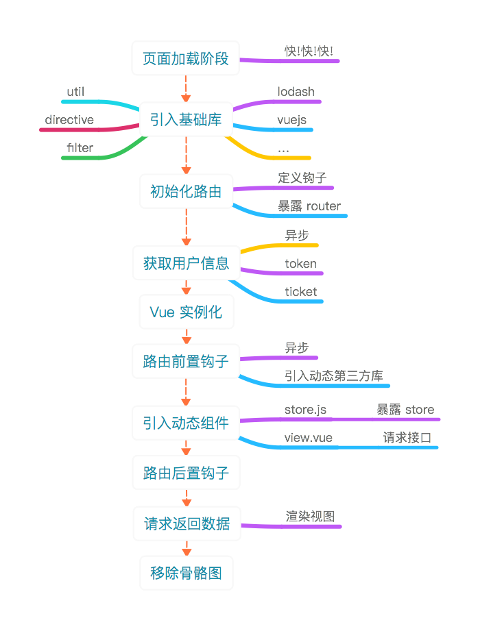

整个大致流程就是这样。

乍看可能跟大家平时开发 `Vue` 项目，没有太大区别。

我着重说几点：

<p class="tip">
Q：为什么「初始化路由」要尽可能早？官方例子中，「初始化路由」与「Vue 实例化」是一并进行的。
<em></em>
A：尽早「初始化路由」，后续逻辑可以通过路由对象进行判断。比如「初始化路由」的下一个阶段「获取用户信息」，需要通过路由的判断选择请求接口获取用户信息或者从缓存中获取等等。
</p>

<p class="tip">
Q：获取路由对象时，如何解决 `vm` 不存在，或者 `vm.$router` 不存在的问题？
<em></em>
A：路由对象是一个独立的对象。尽早初始化后，直接暴露到全局去访问。
</p>

<p class="tip">
Q：引入动态组件时，在 `store.js` 用 `Vuex` 初始化了一个 `store` 实例为什么要暴露到全局上？
<em></em>
A：解决 `vm` 不存在，或者 `vm.$store` 不存在的问题。并且通过 `store.dispatch` 尽快请求接口。
</p>

#### 发布订阅模式 

当我们写 `Vue` 项目的时候，我们喜欢用 `vm.$on` 、 `vm.$emit` 进行事件解耦。

<!-- Note -->
<!-- 但是在 Vue 实例 初始化的时候 我们无法访问 vm 对象也就无法添加事件 -->
<!-- 我推荐家良的 hub.js -->

https://github.com/yyued/hub.js

* Dom 事件
* Pipe 操作

```js
Vue.$event = new Vue;
```

#### 有限状态机 

* 如何在接口请求结束后，移除骨骼图？
* 如何根据接口的状态，显示数据，或者空状态，或者网络异常状态？

<!-- 这时候，引入了有限状态机的概念 -->

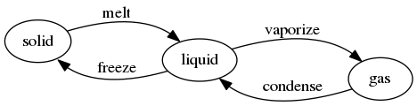

一个有限状态机模型包含：

* 若干状态，可枚举
* 状态流有向，可控

```js
// 哈希
const $default = {
    // 请求数据中
    pending : true,
    // 请求成功
    success : false,
    // 请求失败
    error : false,
    // 重置状态
    reset : false,
};
// 枚举
const $enum = _.keys($default);
// 状态流
const $stream = [
    ['pending', 'success'],
    ['pending', 'error'],
    ['success', 'pending'],
    ['error', 'pending'],
    ['success', 'reset'],
    ['reset', 'pending'],
];
```

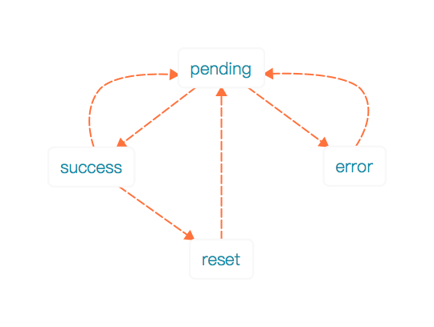

```vue
<template>
    <layout-mescroll v-if="$status.app.success">
        <list v-if="list.length"></list>
        <widget-empty v-if="!list.length" :type="'common'"></widget-empty>
    </layout-mescroll>
    <layout-scroll-box v-if="$status.app.error">
        <widget-empty :type="'network'" @tap="refresh"></widget-empty>
    </layout-scroll-box>
</template>
```

利用有限状态机系统，去统一管理状态，达到状态变量与业务数据解耦的目的。

```js
store.commit('flag', true);
store.commit('active', true);
store.commit('loading', true);
```

降低后续维护成本，减少状态紊乱的可能性。

有限状态机，在实际开发中，有更多的应用场景，比如处理分页加载等等。

### 数据流与数据广播 

数据流与数据广播

#### 响应式数据的逻辑自洽性 

逻辑自洽源于语言学，当表述一个事情的时候，它的前后是不矛盾的。


我这里想强调的意思是，页面显示的数据字段应该与 `store` 保持一致。

无论是开发还是排查，都非常直观。

而后端接口返回的数据格式，应该在接口的后置拦截器做格式化处理。

<!-- Note -->
<!-- 在一个虚拟路由的文件夹内 store 与 view 的字段保持一致 -->
<!-- 有助于后续维护 迭代 迁移等等 -->

#### 不定向广播 

在客户端提供便利的 `SDK` 的前提下，

内嵌页有更多功能发挥的空间。

跨页面通讯就是其中之一。

在移动 OA 中我最常用的就是，父子通讯。

但是在社区，情况更加复杂。

我大概这样去做归纳，

* 定向通讯
    * 父子通讯
    * 爷孙通讯
* 不定向通讯
    * 一对多通讯
    * 多对多通讯
    * 双重身份

---

定向通讯模式，以页面为单位，点对点通讯。

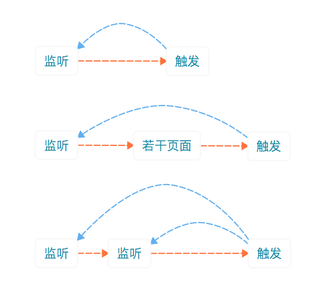

```js
// index
this.$sdk.on('index:send-weibo', ({ data }) => {
   // push data
});
```

```js
// profile
this.$sdk.on('index:send-weibo', ({ data }) => {
   // push data
});
```

```js
// post
this.$sdk.emit('index:send-weibo', data);
```

---

<!-- Note -->
<!-- 定向通讯可以为我们解决大部分通讯问题 -->
<!-- 但是社区微博数据同步的问题则不适用 -->

<!-- Note -->
<!-- 例如你想更新某一条微博的状态 -->
<!-- 但是这条微博可能在路由栈中多个页面都存在 -->
<!-- 而你无法确定哪个页面需要接收这个通讯  -->

不定向通讯，以组件为单位，全应用页面广播。

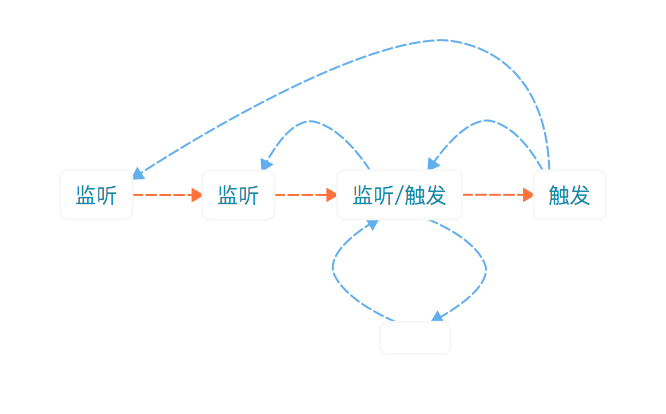

<!-- Note -->
<!-- 不定向通讯核心解决的问题有以下两点 -->

* 如何找到精确的目标，确保通讯成功？
* 如何避免监听者，收到重复的通讯？

```js
// app.vue
this.$sdk.on('app:broadcast', ({ data }) => {
    const { type, uuid, payload } = data;
    this.$event.emit(`${ type }:${ uuid }`, payload);
});
```

```js
// layout-weibo.vue
this.$event.on(`wid:${ uuid }`, () => {});
```

```js
// layout-comment.vue
this.$event.on(`cid:${ uuid }`, () => {});
```

```js
// store.js
Vue.$sdk.emit('app:broadcast', {
    uuid : wid,
    type : 'wid',
    payload,
});
Vue.$sdk.emit('app:broadcast', {
    uuid : cid,
    type : 'cid',
    payload,
});
```

每个页面，收到通讯广播后，再向每个组件进行事件广播。

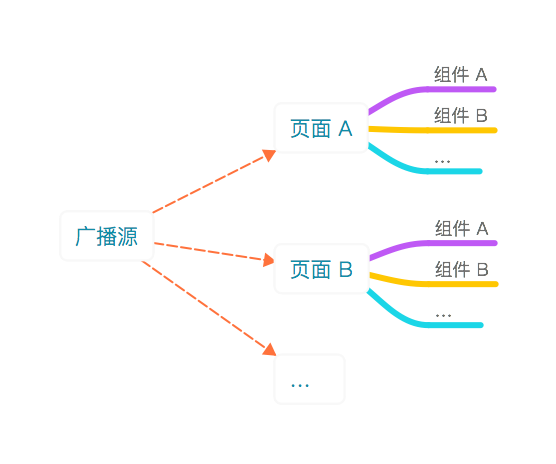

因此，

无论发布微博，发布评论，删除评论，都能同步列表数据，以及评论数。

无论点赞，取消点赞，都能同步点赞状态，以及点赞数。

---

### 其他 

其他

<!-- #### 富文本与表情 -->
<!-- 轻量级富文本核心的实现是 使用 img 标签处理非 -->

<!-- #### 列表删除 -->
<!-- 列表中 被移除的元素 并不会从数组中移除 而是用一个状态字段 隐藏该数据  -->

<!-- #### 问题定位与黑盒子 -->
<!-- 暴露到全局对象上 通过 vue.$history 记录 api / event / notification / store 的记录 -->

#### 调试模式 

`LegoFlow` 自带的 `url#dev` 调试模式，

在前端路由的项目下并不合适，后续可能需要优化一下。

## 后记 

很多东西都是第一次做。而这些解决方案都是当时摸索着，又经历过实践、推倒、实践，渐渐成型。以上就是我的总结了。

<button>下一章节</button>

<br>